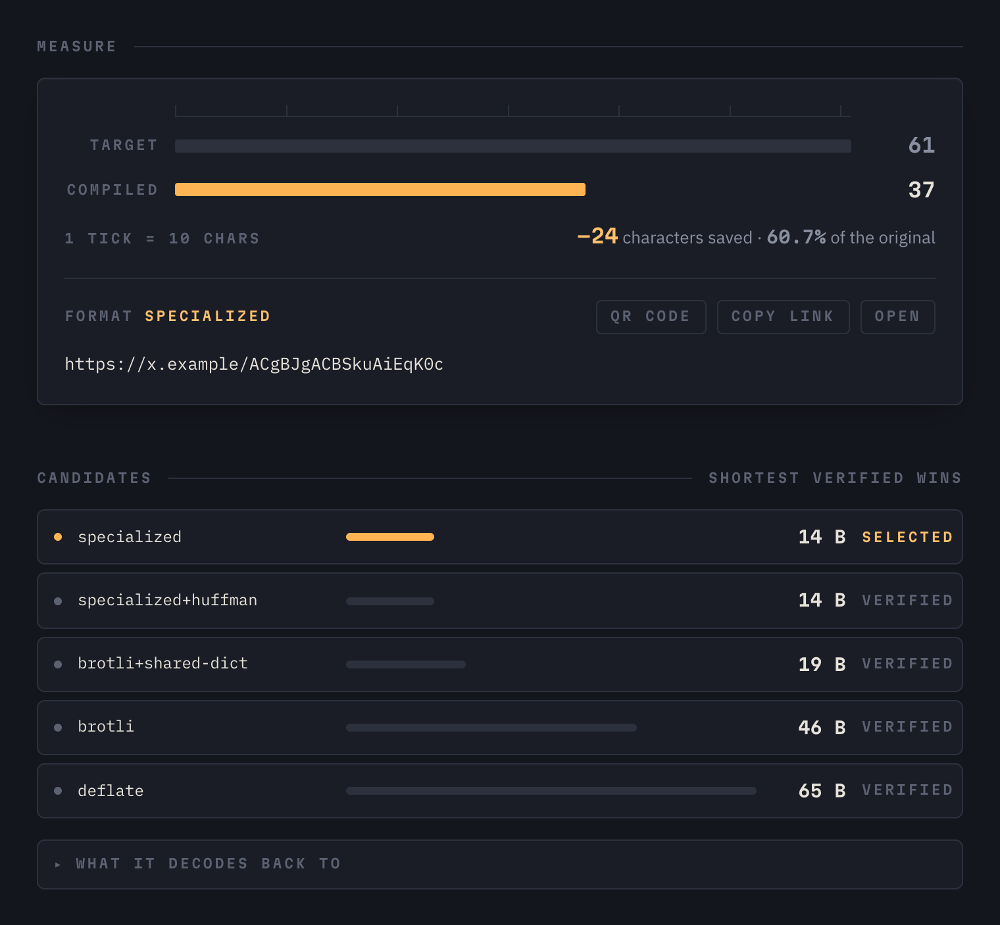
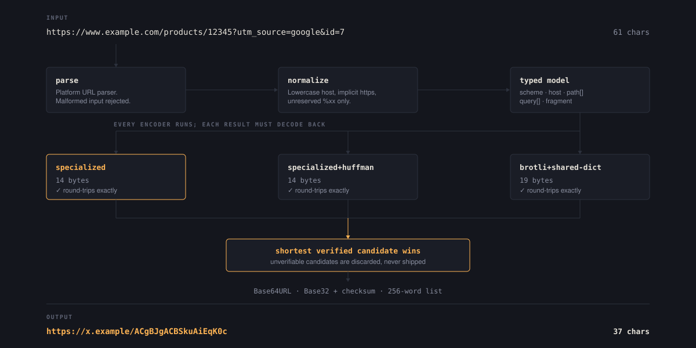
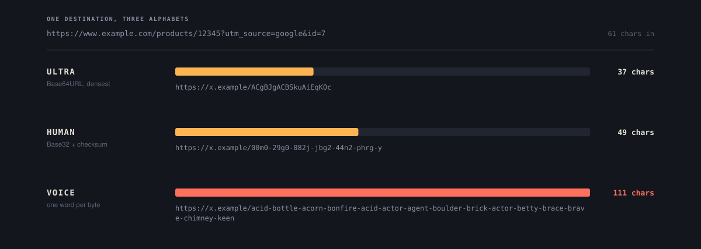
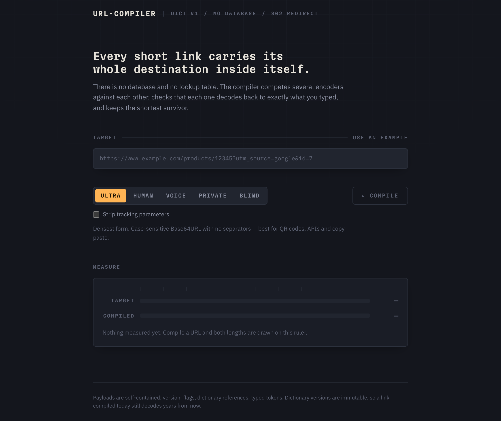
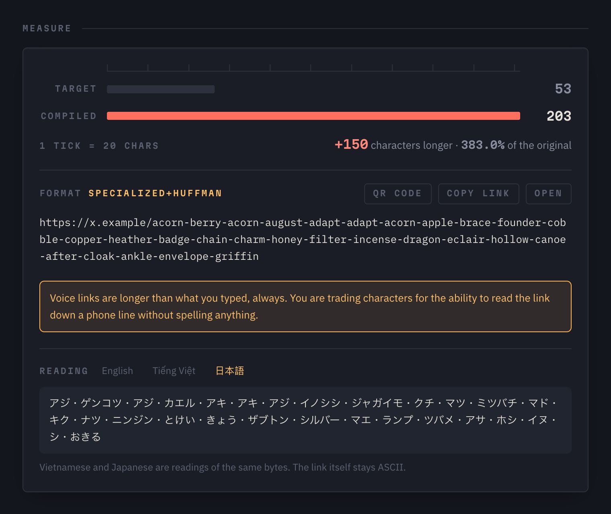
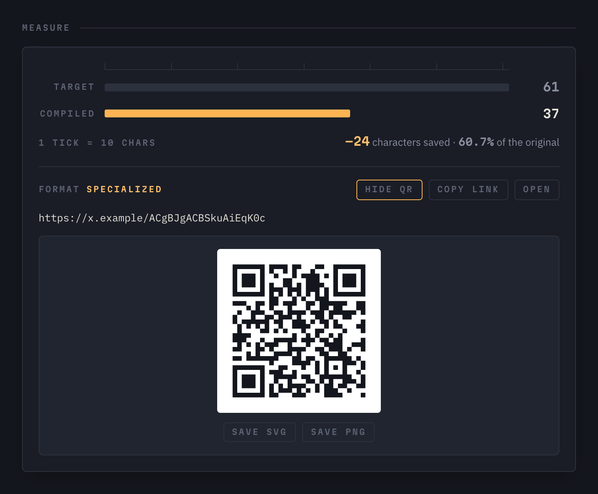
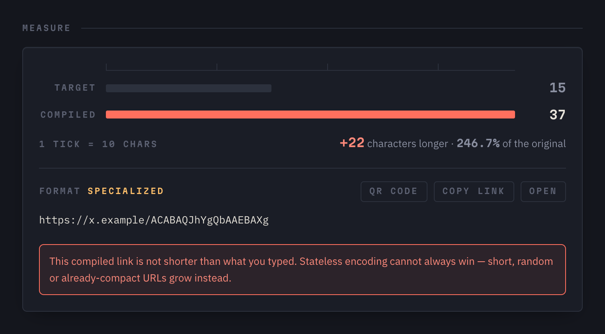
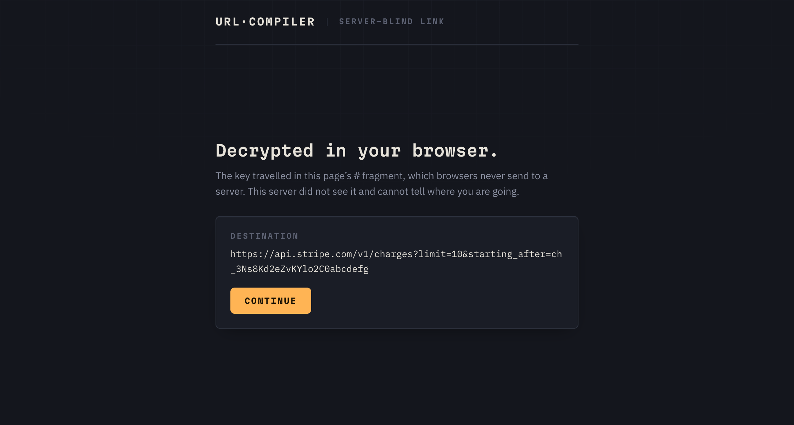
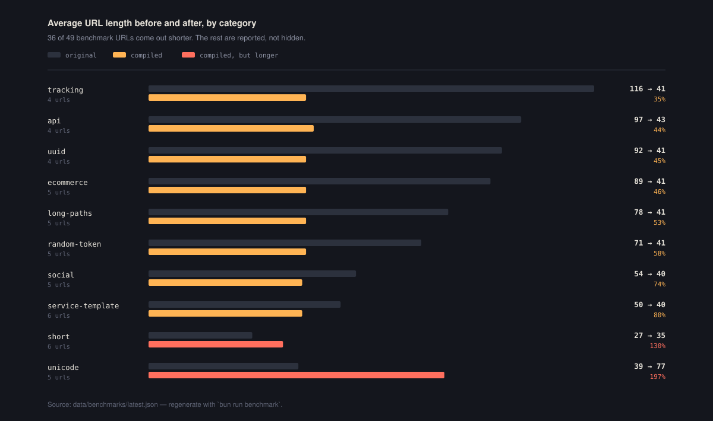
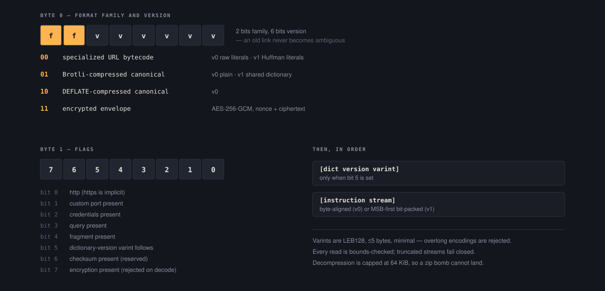

<div align="center">

# URL Compiler

**A stateless URL shortener.** No database, no stored destinations, no lookup table.
Every short link carries its whole destination inside itself.

<picture>
  <source media="(prefers-color-scheme: dark)" srcset="docs/media/compiled-ultra.png">
  <source media="(prefers-color-scheme: light)" srcset="docs/media/compiled-ultra-light.png">
  
</picture>

</div>

---

## The idea in ten seconds

```text
https://www.example.com/products/12345?utm_source=google&id=7   61 chars
https://x.example/ACgBJgACBSkuAiEqK0c                           37 chars
```

That second URL is not a database key. It is the first one, compiled: parsed into a typed model,
compressed into a binary instruction stream, and re-encoded in the shortest safe alphabet. Nothing
was written down anywhere. Delete the server, rebuild it on another continent from this source, and
the link still resolves.

The catch is stated up front, in the interface and here: **a stateless URL cannot always be
shorter.** Short, random, or already-compact URLs come out longer, and the app says so with exact
counts instead of pretending otherwise.

## Try it

```bash
bun install
bun run dev          # http://localhost:3000
bun run cli encode "https://github.com/anthropics/claude-code/issues/1234"
```

## How it works

<picture>
  <source media="(prefers-color-scheme: dark)" srcset="docs/media/pipeline.svg">
  <source media="(prefers-color-scheme: light)" srcset="docs/media/pipeline-light.svg">
  
</picture>

1. **Parse** with the platform `URL` parser into a typed model — scheme, host, path segments,
   ordered query pairs, fragment. Malformed URLs are rejected immediately.
2. **Normalize** conservatively: lowercase host, default-port removal, implicit HTTPS,
   percent-decoding of *unreserved* escapes only (`%41` → `A`). Reserved escapes (`%2F`, `%2B`,
   `%26`, `%3D`) survive verbatim. Query order, duplicate keys, `?flag` vs `?flag=`, bare `?`/`#`
   markers and trailing slashes all round-trip exactly.
3. **Compile** into a binary instruction stream of typed opcodes: dictionary references, inline
   small integers, zigzag varints, UUIDs, hex runs, booleans, `REPEAT` and `BACKREF`. Path segments
   are optimized by dynamic programming, not greedy matching — a two-character literal can beat an
   opcode plus a dictionary id, and the encoder knows it.
4. **Compete.** Specialized bytecode, Brotli, shared-dictionary Brotli and DEFLATE all run. Each
   candidate must satisfy `decode(encode(url)) === canonical` before it is eligible. The shortest
   *verified* one wins; the rest are discarded.
5. **Redirect** statelessly: payload → alphabet decode → envelope → bytecode decode → validate →
   302. Decode latency is reported in `Server-Timing`.

## Three alphabets, one payload

<picture>
  <source media="(prefers-color-scheme: dark)" srcset="docs/media/modes.svg">
  <source media="(prefers-color-scheme: light)" srcset="docs/media/modes-light.svg">
  
</picture>

| Mode | Alphabet | Use it when |
| --- | --- | --- |
| **Ultra** | Unpadded Base64URL, case-sensitive, no separators | APIs, QR codes, copy-paste |
| **Human** | Crockford-style Base32 (`i l o u` excluded), hyphen groups of 4, Luhn-mod-32 checksum | Someone has to retype it |
| **Voice** | 256-word list, one word per byte, plus a checksum word | Someone has to say it aloud |

Human mode accepts `o→0`, `i→1`, `l→1` on decode but only ever generates canonical characters. On
checksum failure the redirect is refused, and a correction is suggested only when exactly one
single-edit candidate validates.

Voice mode is longer by design — the value is reading it down a phone line, not density. The
wordlist is immutable; changes require a new codec version. Vietnamese and Japanese readings are
display-only renderers of the same word indices (spec §15): the canonical payload stays pure ASCII
and always decodes through the English list.

> No Unicode or emoji in the canonical payload, ever. Unicode is welcome in *destinations* (encoded
> as compact UTF-8 inside literals), but payload alphabets stay pure ASCII to avoid homograph,
> normalization and percent-encoding abuse (UTS #39).

## The interface

<table>
<tr>
<td width="50%"></td>
<td width="50%"></td>
</tr>
<tr>
<td><b>Idle.</b> The ruler is visible before you use it, so the units are obvious.</td>
<td><b>Voice mode.</b> One word per byte, with localized readings of the same indices.</td>
</tr>
<tr>
<td></td>
<td></td>
</tr>
<tr>
<td><b>QR.</b> Always dark-on-white regardless of theme, so it actually scans.</td>
<td><b>Honest failure.</b> When the compiled link is longer, it says so.</td>
</tr>
</table>

<details>
<summary><b>Server-blind links, and how they look on arrival</b></summary>

<br>



The key lives in the URL fragment, which browsers never send to a server. The landing page decrypts
locally, shows the destination, and offers a **Stay here** escape from the three-second countdown.

Honest labelling: the server is blind, the link holder is not. Anyone holding the whole link —
fragment included — can decrypt it.

</details>

## Does it actually make links shorter?

Sometimes. Here is every benchmark category, wins and losses alike:

<picture>
  <source media="(prefers-color-scheme: dark)" srcset="docs/media/benchmark.svg">
  <source media="(prefers-color-scheme: light)" srcset="docs/media/benchmark-light.svg">
  
</picture>

Tracking-heavy, UUID, API and e-commerce URLs collapse to roughly a third of their length. Already
short URLs grow by about 30%, and Unicode-heavy URLs roughly double — the payload has to carry those
bytes and Base64 costs 4 characters per 3 bytes.

Payload-level comparison against a raw Base64URL baseline (average bytes, from
`data/benchmarks/benchmark.json`):

```text
category           raw-b64url   specialized   auto-selected   ratio
tracking                  177           102              41   0.232
uuid                      146            97              41   0.281
api                       152           120              43   0.283
long-paths                126           103              41   0.325
service-template           89            65              40   0.449
unicode                   145            84              77   0.531
```

`auto-selected` beats `specialized` because shared-dictionary Brotli wins on structural URLs.
The regression baseline lives in `data/benchmarks/baseline.json`; corpus tests fail on a >5%
category regression.

## Binary format

<picture>
  <source media="(prefers-color-scheme: dark)" srcset="docs/media/envelope.svg">
  <source media="(prefers-color-scheme: light)" srcset="docs/media/envelope-light.svg">
  
</picture>

The instruction stream is a host section (`HOST_FULL` / labels + `SUFFIX` / literal, terminated by
`END`), optional credentials, optional `PORT`, a path segment count with DP-optimized segment
instructions, an optional query pair count with typed key/value instructions, and an optional
`FRAGMENT`.

Inline ranges: `0x20–0x3F` = context-dependent `DICTIONARY_0..31`, `0x40–0x5F` = `INTEGER_0..31`.
All reads are bounds-checked; truncated streams, invalid opcodes, out-of-range dictionary ids,
non-UTF-8 literals and oversized decompression output are rejected with typed `DecodeError`s.

<details>
<summary><b>Format v1: Huffman literals</b></summary>

<br>

In v1 the instruction stream is bit-packed MSB-first. Opcodes, varints and typed values still occupy
8-bit groups; only `LITERAL_BYTES` content is coded with a frozen canonical Huffman table
(`data/dictionaries/huffman-v1.json`, 111 symbols plus an escape, averaging 5.84 bits/byte). Bytes
outside the table use an escape code (9 bits + 8 raw bits), so every input stays encodable.
Credentials and fragments stay raw.

The table is immutable — changing it would require format version 2. v0 and v1 compete as separate
candidates and each is verified, so escape-heavy inputs simply keep their v0 encoding. Measured:
−5% to −17% payload on every benchmark category versus v0, and zero effect on v0 payloads (proven by
golden tests).

</details>

<details>
<summary><b>Service templates</b></summary>

<br>

`lib/codec/templates.ts` holds versioned, immutable-ID templates that absorb host, path and query
structure into a single opcode when they win on size. YouTube watch/shorts (per-host IDs), GitHub
repo/issues/pull, and Amazon ASIN are covered.

**Exact-form semantics**: reconstruction is byte-identical to the input. Anything that would be
dropped or rewritten — alternate hosts like `m.youtube.com`, `t=1m30s` durations, `/gp/product`
paths, ref queries — blocks the template and falls back to generic bytecode. No silent
canonicalization, ever.

</details>

<details>
<summary><b>Dictionaries</b></summary>

<br>

`data/dictionaries/v0.json` and `v1.json` are **immutable forever**: `hosts`, `labels`, `suffixes`
(multi-label PSL-style: `co.uk`, `github.io`, …), `paths`, `queryKeys`, `values`. IDs never change
meaning. New dictionaries get new version numbers, are selected by an envelope flag plus a varint,
and every old version stays decodable — golden tests prove it across versions.

v1 is active: frequency-tuned inline-32 slots and new tokens, **−12.2% corpus payload** versus v0.
The builder guards against overfitting with a `--min-count` frequency floor (default 2) and an
entropy/shape filter that rejects single-occurrence and random-looking tokens. Dictionaries must
generalize, not memorize the corpus.

```bash
bun run dict:analyze   # frequency analysis → candidate tokens
bun run dict:build     # draft the next version; refuses to touch existing files
```

</details>

<details>
<summary><b>Compression decisions, and what got rejected</b></summary>

<br>

- **Brotli / DEFLATE** — emitted candidates, verified round-trip, shortest complete URL wins.
- **Shared-dictionary Brotli** (brotli format version 1) — a frozen LZ77 dictionary v0 ships with
  the code as a base64 TS module, so payloads never carry it. Encoding uses WASM on Node and Bun
  (runtimes without it skip the candidate); decoding uses the pure-JS Google implementation so
  workerd decodes without WebAssembly, verified with a real 302 on workerd. Held-out evaluation:
  8 of 15 wins versus specialized, with automatic fallback on novel-content URLs.
- **Zstandard** — benchmarked with a raw-content dictionary and **rejected**. Frame overhead
  dominates at URL scale; it loses everywhere. Not wired in.
- **Range coder (format v2)** — fully implemented and fuzz-verified, with a carry-propagating range
  coder and a static model derived from the frozen Huffman lengths. Decode is supported forever, but
  it is **not emitted**: pool framing (~5 bytes) exceeds the ~0.3% entropy gain over Huffman across
  the entire URL domain, including 2.4 KB payloads. Kept for future large-payload scenarios.

</details>

<details>
<summary><b>Privacy modes (spec §17)</b></summary>

<br>

Disabled by default (`ENABLE_PRIVATE_MODE=false`). Both use AES-256-GCM through WebCrypto, with
identical behaviour on Node, Bun and workerd. The UI reads `GET /api/capabilities` and renders these
modes as unavailable-with-a-reason rather than letting them fail on click.

- **Private (server-readable)** — the winning candidate is wrapped in the encrypted format family
  (`11`): `[0xC0][flags][12-byte nonce][ciphertext+tag]`. Decryption tries `PAYLOAD_KEY_CURRENT`
  then `PAYLOAD_KEY_PREVIOUS`, so key rotation keeps old links alive. The inner payload may be any
  format family; nesting encrypted-in-encrypted is rejected. GCM authentication makes tampering and
  wrong keys fail closed.
- **Blind (server-blind)** — `https://x.example/p/<ciphertext>#<key>`. An ephemeral per-link key
  lives in the fragment, which browsers never send to servers. The `/p/…` landing page decrypts
  locally, shows the destination, and redirects after a three-second countdown you can cancel.

Encryption is never applied implicitly: ultra, human and voice stay plaintext unless the encrypted
mode is explicitly requested.

</details>

<details>
<summary><b>Security</b></summary>

<br>

- Redirect targets must parse as absolute `http:`/`https:` URLs. `javascript:`, `data:`, `file:`,
  `vbscript:`, `about:` and friends are rejected by allowlist. Control characters (CRLF injection)
  are rejected. The server never fetches destinations.
- Limits: 2048 payload chars, 8192 target chars, 64 path segments, 64 query pairs, 1024-byte
  components, and a 64 KiB decompression cap as a zip-bomb guard.
- Headers: `X-Content-Type-Options: nosniff`, `Referrer-Policy: no-referrer`, `X-Frame-Options`,
  CSP on HTML routes, `X-Robots-Tag: noindex` on redirects.
- Per-IP fixed-window rate limiting in memory — per-instance, since there is no database by design.
- Dictionary-version mismatches, unknown formats and malformed bitstreams all fail closed.

</details>

## Project layout

```text
app/                  page, encode/inspect/capabilities APIs, catch-all redirect, blind landing
app/_components/      measure rail, mode radiogroup, QR panel
lib/url/              typed model, parser, safe normalizer, limit validation
lib/codec/            opcodes, varint writer/reader, specialized bytecode, brotli, deflate,
                      huffman, range coder, candidate selection and verification
lib/dictionaries/     immutable versioned dictionaries and registry
lib/alphabet/         base64url, base32 + grouping + aliases, Luhn-mod-32 checksum, wordlists
lib/security/         redirect validation, limits, rate limiting
lib/crypto/           AES-256-GCM envelope, ephemeral keys
data/                 dictionary versions, corpus, benchmark results, golden payloads
docs/media/           generated screenshots and diagrams (SVG + PNG)
tests/                codec (fixtures + property), normalization, security, corpus
tools/                benchmark, corpus analysis, dictionary builder, screenshots, diagrams
```

## Scripts

```bash
bun run dev          # development
bun run build        # production build
bun run start        # production server
bun run test         # bun test (422 tests)
bun run lint         # eslint (Next 16 removed `next lint`; direct eslint is the successor)
bun run typecheck    # tsc --noEmit
bun run benchmark    # size/latency benchmark across strategies and categories
bun run cli          # CLI: encode/decode/inspect (bun cli.ts --help)
bun run media        # regenerate every diagram and screenshot in docs/media
```

`bun run media` needs a Chromium in the local Playwright cache. If you do not have one:
`bunx playwright install chromium`. Diagrams also need `rsvg-convert` (`brew install librsvg`).
Both are development-only; neither ships with the app.

## Environment

```text
PUBLIC_ORIGIN=https://x.example      # origin used for generated URLs
ENABLE_PRIVATE_MODE=false            # enables private + blind modes in the API and UI
PAYLOAD_KEY_CURRENT=                 # 32-byte base64url AES key (new encryptions)
PAYLOAD_KEY_PREVIOUS=                # optional; keeps old links decodable across rotation
ACTIVE_DICTIONARY_VERSION=1
MAX_PAYLOAD_LENGTH=2048
MAX_TARGET_LENGTH=8192
```

On Cloudflare, set secrets with `wrangler secret put PAYLOAD_KEY_CURRENT` — never in `vars`.
Locally use `.dev.vars`, which is gitignored.

## Deployment

Two supported targets, one codebase, byte-identical decode behaviour.

**Self-hosted (Node / Bun)**

```bash
bun run build && bun run start
```

**Cloudflare Workers (workerd)**

```bash
bun run preview:cloudflare   # build + local workerd preview (miniflare)
bun run deploy:cloudflare    # build + wrangler deploy
```

Uses `@opennextjs/cloudflare` with `nodejs_compat` (see `wrangler.jsonc`, `open-next.config.ts`).
Parity is verified: specialized, Brotli and DEFLATE payloads all decode identically under workerd.
The compression adapter (`lib/codec/compress.ts`) prefers `node:zlib` and falls back to Web
`DecompressionStream` per format, capability-detected at runtime. Cloudflare also works as a plain
CDN in front of a self-hosted origin.

Runtime notes: patched Next.js **16.2.11** (July 2026 security release — 4 high, 5 medium),
exact-pinned with the lockfile committed. Pin runtime versions in deployment and confirm local and
production decoders agree; the round-trip and golden tests are the contract.

## Status

Nothing on the original roadmap remains open. Possible future work: trained (rather than
corpus-snapshot) dictionaries for v2+, more service templates, and publishing `urlc` to npm for
global CLI install. Encode history is stored in `localStorage` only — the server stays fully
stateless.
